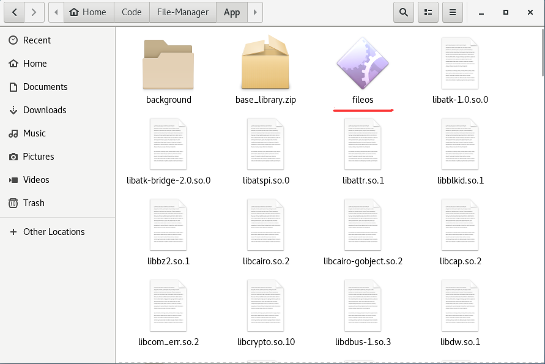
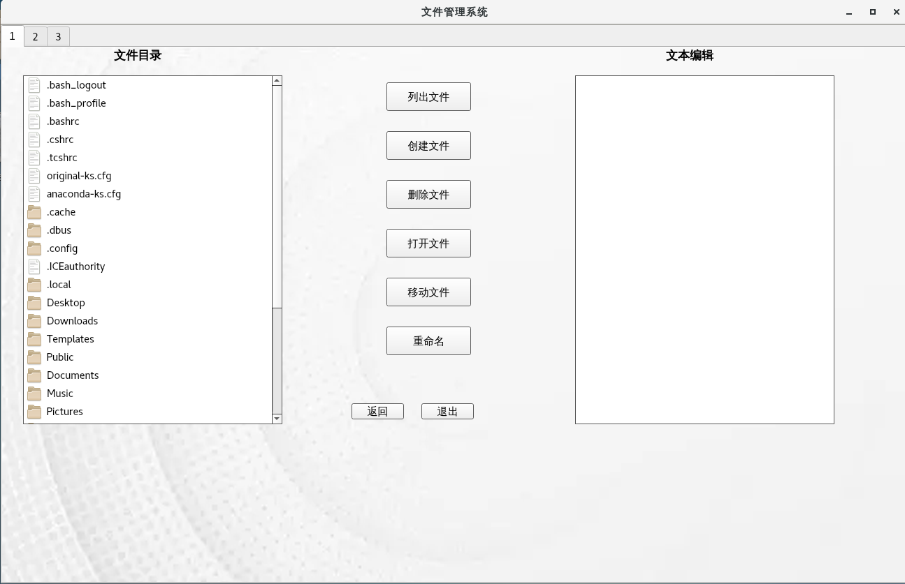
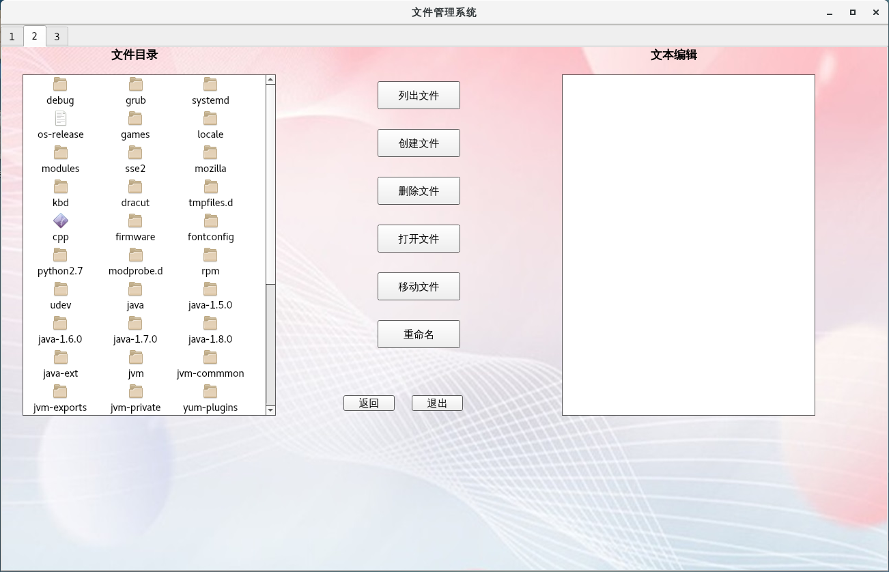
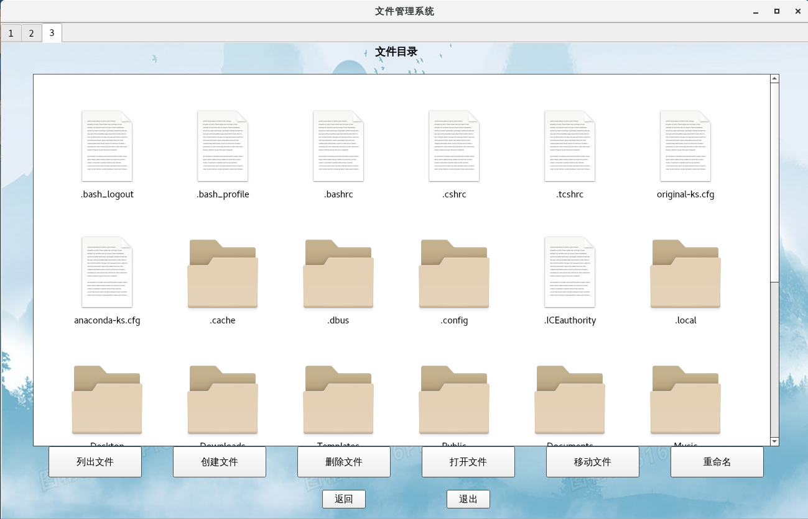

# Linux-FileManager

    随着数字化信息的急剧增长，传统文件管理系统或操作系统提供的文件管理工具可能存在一些限制，无法完全满足用户需求。
    这可能包括有限的搜索功能、不便利的用户界面或缺乏个性化的功能。

    针对上述挑战和需求，本项目旨在开发一个灵活、高效和用户友好的文件管理系统。这个系统将致力于解决传统文件管理系
    统存在的问题，并提供更好的文件管理体验。

    通过深入了解现有挑战并设计解决方案，本文件管理系统可以帮助用户更有效地管理其文件、提高工作效率。

## 项目安装
将本项目源码下载到本地上后，进入到项目文件夹中，运行以下代码：

> pip3 install -r requirements.txt

如果下载遇到问题，根据以下步骤一步一步来：

- 更新yum源
  > sudo yum upgrade

- 确保python版本以及相关依赖正确
  > sudo yum install python3
  >
  > sudo yum -y install python3-devel

- 调用镜像下载相关依赖
  > sudo pip3 install -i https://pypi.tuna.tsinghua.edu.cn/simple/ -r requirement.txt

## 使用指南
可以使用命令行运行python文件使用本程序
> python3 fileos.py

也可以进入到App文件夹下，找到fileos的可执行文件双击运行

## 截图演示
本程序设计了三种页面供用户选择使用，并且页面风格也略有不同，适合不同的用户的需求，下面分别是三种页面的展示截图

## 联系方式
如果您对我们的产品感兴趣，请联系邮箱Cy1901753749@gmail.com
